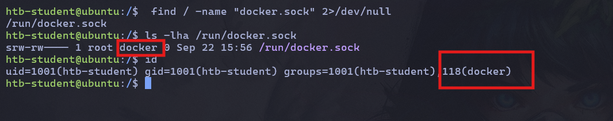

# Master Recon for Bug Hunters and Pentesters — Part 1: Shodan & URLScan \&VirusTotal — Advanced Tricks

Hi everyone! In this crash course, we'll learn about reconnaissance and how to use it to uncover what others may have missed.

By the end of this quick tutorial, you'll have a better understanding of how to approach reconnaissance effectively and how to turn your findings into potential attack surfaces worth investigating.


I will start with **manual reconnaissance** for deeper discovery, and then move on to automated tools in anthor writeups.

### Shodan

[**Shodan**](https://www.shodan.io/) is a specialized search engine that allows bug hunters to find internet-connected devices, servers, exposed services, and other network assets.

For a basic Shodan cheat sheet, you can use this [resource](https://mr-koanti.github.io/shodan).

However, here I will focus on useful tricks that can help you find things that others might miss.

#### Favicon Hash

From the terminal, run:

```bash
cat subdomain.txt | httpx -favicon
```

This will help you collect the favicon information for your subdomains.

You can then use the favicon hash in Shodan with:

```
http.favicon.hash:<HASH_VALUE>
```

This can help you find other hosts using the same favicon.

You can also use FOFA to find favicon hashes. Search for:

```
domain="example.com"
```

FOFA will return the discovered assets, and you can find the available favicon icons in the left sidebar.

<figure><figcaption></figcaption></figure>

#### Another Cool Trick in Shodan

As we know, the Shodan free tier provides only **50 total results**.

We can work around this limitation by using filtering tricks.

For example, when I search for:

```
ssl.cert.subject.cn:"adobe.com"
```

I get **40,485 results**.

<figure><figcaption></figcaption></figure>

You can narrow down the results by filtering based on things like the **IP address** or **HTTP title**.

<figure><figcaption></figcaption></figure>

Go to **More**, then select **HTTP Title**. After that, you can filter out common HTTP titles such as `404 Not Found`, `302 Found`, or other error pages.

For example:

```
ssl.cert.subject.cn:"adobe.com" -http.title:"404 Not Found" -http.title:"302 Found" -http.title:"ERROR: The request could not be satisfied"
```

As you can see, the number of results is reduced from **40,485 to 5,815**.

<figure><figcaption></figcaption></figure>

#### Another Cool Trick

If you find an IP address that returns **403 Forbidden** or **Bad Request**, you can try sending different `Host` headers based on the hostnames you discovered during reconnaissance. I’ll cover this technique in more detail in a later part of the blog.

<figure><figcaption></figcaption></figure>

&#x20;try  fuzz the `Host` header using the subdomains you discovered during recon:

```bash
ffuf -u http://13.225.63.221 -H "Host: FUZZ" -ic -c -w ./subdomain.txt -r
```

In this example, the IP initially returns a `403` response, but some hostnames may return a different response, such as `200 OK`.

<figure><figcaption></figcaption></figure>


### URLScan

[**URLScan**](https://urlscan.io/) allows you to search for URLs and domains that have been scanned and indexed by the service.

You can search for a domain and filter out specific subdomains. For example:

```
domain:adobe.com -domain:www.adobe.com
```

Another cool trick is using wildcards to search for specific subdomain patterns:

```
domain:admin*.adobe.com
```

If you want to quickly extract URLs from the terminal, you can use this simple `curl` command:

```bash
curl -s 'https://urlscan.io/api/v1/search/?q=domain:www.adobe.com' | jq -r '.results[].page.url'
```

However, there are other tools that can automate this process and provide better results. We’ll cover them in another section.


### VirusTotal

[**VirusTotal**](https://www.virustotal.com/) is a security platform that collects information about files, domains, URLs, and IP addresses from multiple security sources.

You can search for a **domain or subdomain** to discover URLs and other information associated with it.

You can also use the VirusTotal API to retrieve domain information:

```
https://www.virustotal.com/vtapi/v2/domain/report?apikey={APIKEY}&domain={DOMAIN}
```

**Finding Sensitive Paths**

One useful trick is to extract URLs associated with a domain and search for potentially sensitive paths or parameters.

For example:

```bash
curl -s "https://www.virustotal.com/vtapi/v2/domain/report?apikey=$VT_API_KEY&domain=adobe.com" |
jq -r '.detected_urls[]?.url' |grep -Ei 'token=|api[_-]?key=|apikey=|access[_-]?token=|auth(entication)?=|bearer[ =]|reset[-_]?password|forgot[-_]?password|registration|signup|sign[-_]?up|\.env([/?#]|$)|config(uration)?|credentials?|secret'
```

You can also search for URLs pointing to potentially sensitive file types:

```bash
curl -s "https://www.virustotal.com/vtapi/v2/domain/report?apikey=$VT_API_KEY&domain=adobe.com" | jq -r '.detected_urls[]?.url' |grep -Ei '\.(zip|tar|dll|tar\.gz|tgz|gz|bz2|xz|7z|rar|bak|backup|old|orig|swp|sql|db|sqlite|log|conf|config|ini|env|yml|yaml|xml|json|csv|md|txt|pdf|docx?|xlsx?|pptx?)(\?|#|$)'
```

These filters can help you quickly identify interesting URLs that may deserve further manual investigation.

### Automation

For Shodan, you can use the **Shodan CLI**, but I recommend using the **Shodan web interface** when you need more advanced filtering and deeper asset discovery.

#### Shodan-Powered Subdomain Finder

**Shosubgo** is a simple Go tool that uses the **Shodan API** to quickly enumerate subdomains for a target domain. It’s lightweight, fast, and useful during the reconnaissance phase.

* Requires a free **Shodan API key**.

```bash
# Single domain
shosubgo -d target.com -s YourAPIKEY

# Multiple domains from a file
shosubgo -f domains.txt -s YourAPIKEY
```

#### Waymore

**Waymore** is one of my favorite tools for URL discovery. If you look closely at its source code, you can see that it collects URLs from multiple sources, including Wayback Machine, Common Crawl, AlienVault OTX, URLScan, VirusTotal, IntelX, and GhostArchive.

Some of the sources used by Waymore include:

```
# Source Provider URLs
WAYBACK_URL = "https://web.archive.org/cdx/search/cdx?url={DOMAIN}{COLLAPSE}&fl=timestamp,original,mimetype,statuscode,digest"
CCRAWL_INDEX_URL = "https://index.commoncrawl.org/collinfo.json"
ALIENVAULT_URL = "https://otx.alienvault.com/api/v1/indicators/{TYPE}/{DOMAIN}/url_list?limit=500"
URLSCAN_URL = "https://urlscan.io/api/v1/search/?q=domain:{DOMAIN}{DATERANGE}&size=10000"
URLSCAN_DOM_URL = "https://urlscan.io/dom/"
VIRUSTOTAL_URL = "https://www.virustotal.com/vtapi/v2/domain/report?apikey={APIKEY}&domain={DOMAIN}"
INTELX_BASES = ["https://2.intelx.io", "https://free.intelx.io"]
GHOSTARCHIVE_URL = "https://ghostarchive.org/search?term={DOMAIN}&page="
GHOSTARCHIVE_DOM_URL = "https://ghostarchive.org"
```

To make sure Waymore works properly, don't forget to add your API keys to:

```
~/.config/waymore/config.yml
```

#### Passive URL Extraction

For fast passive URL extraction, you can use:

```bash
waymore -i target.com -mode U -oU urls.txt
```

#### Download Archived Responses

Unlike many other URL collectors, Waymore can also download the **actual historical responses** saved by archives.

This is especially useful for analyzing old HTML and JavaScript files to find things such as **developer comments, hidden parameters, old endpoints, and accidentally exposed secrets**.

Keep in mind that downloading responses can take more time and require significantly more disk space, but it can be a very useful technique for discovering hidden attack surface.

To download archived responses specifically, use:

```bash
waymore -i target.com -mode R -oR ./responses
```

#### Full Recon: URLs + Responses

To collect URLs and download archived responses at the same time:

```bash
waymore -i target.com -mode B -oU urls.txt -oR ./responses
```
